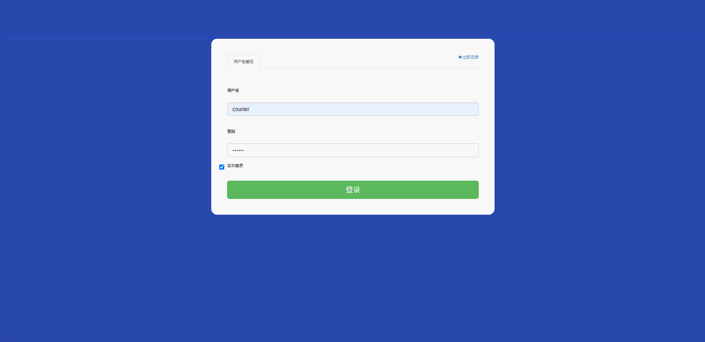

#  express-delivery🎂

基于SpringBoot+Thymeleaf的校园快递管理系统

## 介绍🌞

> 该校园快递管理系统致力于改变传统的快递管理方式，旨在提高驿站管理人员的工作效率和快递分发的速度。系统能够在不使用传统纸质记录的情况下，存储和管理庞大的数据量，同时为驿站管理者、快递员和用户提供了一个更加清晰和便捷的操作界面。系统界面的简洁设计使用户能够轻松上手，而功能模块的优化则进一步提升了用户体验。这确保了所有使用者都能在一个高效和用户友好的环境中进行操作。同时，系统的功能模块是根据用户的实际需求定制的，允许管理人员在线上便捷地添加、修改、查看和删除快递信息。在系统设计过程中，也应重视管理员的操作需求，以确保能够提升其工作效能

## 软件架构

校园快递管理系统主要使用者分为三种，一是驿站管理员，二是快递员，三是用户，其中管理员模块属于是控制模块，管理员有查看和管理所有用户的信息、快递订单，回收订单，并且可以冻结账号，处理用户反馈等功能；快递员模块有查看派送单信息，处理用户反馈等功能；用户模块有在线寄件，查看自己的快递，用户反馈等功能。

## 项目演示🌞

> 管理员


> 普通用户


> 配送员




## 安装教程🌞

```
1. 运行环境准备mysql8 + java8 + redis

2. 配置maven路径，加载依赖

3. 运行sql文件，确保application.yml或config.properties的数据库名称和账号密码是数据库所在主机的账号密码
```


## 使用说明🌞

```
1. 登入

		管理员账号：admin 密码：123456

        配送员账号：courier 密码：123456

        普通用户账号：user 密码：123456
  
2. 运行流程

SpringBoot+Vue项目的部署详情可以查看这篇CSDN博客：http://t.csdnimg.cn/kpuxS

前后端不分离项目的部署流程可以查看这篇CSDN博客：http://t.csdnimg.cn/CslA5
```


## CSDN项目合集🌞

点击前往：http://t.csdnimg.cn/Q4u84


## 联系我🌞

**有偿获取完整源码或调试代码**

🐧：1902317191

微信：


